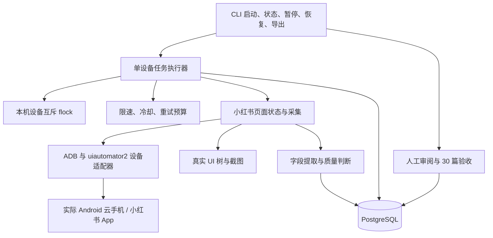

# 第一阶段架构与扩容边界

第一阶段是一台真实 Android 云手机上的小红书图文采集程序，由实验室在普通终端独立启动。关键词搜索、页面操作、字段提取、异常处理和任务恢复使用普通程序执行；日常运行不依赖 Agent 或大模型服务。

本文描述实现约定与验收边界。当前已接入真实云手机，并完成单关键词自动采集；用户已确认本轮结果通过验收。多关键词批次的软件验证和原计划 3 个关键词的完整验收单独记录，不能从软件测试推定实机效果。

## 1. 运行结构

- 设备适配器只处理明确 serial 对应的连接、页面操作与快照。
- 小红书采集模块通过已校准的页面规则识别搜索页、结果页和详情页，不能假定未验证的控件 ID。
- 解析层保留字段原文、状态、提取方式及质量；可选字段缺失不填零，近似计数保留近似标记。
- 可选本地 OCR 只识别已校准的页面文本区域，保留区域与置信度，不读取笔记配图，不把 OCR 文本当作可信笔记 ID。
- PostgreSQL 从第一版保存任务、运行、进度、观察记录与人工审阅。截图和 UI 树作为证据保存并与记录关联。
- CLI 提供诊断、校准检查、当前页采集、任务运行、状态、暂停／恢复、导出、人工审阅和验收入口，不建设控制台或微服务。
- 多关键词批次在同一事务创建有序子任务，持久保存任务归属，整批持有同一设备锁并依次复用执行器。恢复不会重建已经结束的任务。批次汇总导出从同一次数据库查询生成 CSV／JSONL。实现说明见 [单机批量采集](BATCH_COLLECTION.md)。

## 2. 持久化与身份

任务 ID、单次运行 ID、逻辑设备 ID、实际设备 serial 和会话标识相互区分。`Candidate` 中的坐标和卡片键只属于当前页面会话，不能作为跨重启身份或永久地址。

持久化至少覆盖任务关键词与采集目标、累计进度、尝试预算、冷却期限、终止／暂停原因、已提交观察及其证据。设备操作不占用长数据库事务；观察写入与对应任务进度在同一事务提交。

有可信平台笔记 ID 时按该身份进行幂等处理。没有可信 ID 时保留独立观察及候选重复信息，由人工结合证据指定全局人工身份。人工身份不是平台 ID，文本指纹不能提供精确去重保证。

`eligible` 表示基础字段质量满足条件：图文类型、可读正文、可读作者以及可读或确实未显示的标题；0.5.0 起不自动判断正文完整性。它既不表示可信唯一身份，也不表示人工验收通过。最终验收要求 3 个关键词各 10 篇，跨关键词合计 30 篇不同且全部经过人工核对的笔记。

证据保存失败时不能把记录标记为可验收。文件证据与数据库不是同一事务系统，异常后需保留可追溯状态；不能宣称两个存储介质天然具备共同原子提交。

## 3. 单设备恢复与异常策略

恢复时重新打开搜索、重放同一关键词及已配置条件、从结果顶部扫描，并利用已持久化的可靠身份跳过已知内容。不得通过旧的卡片序号、坐标或滚动偏移直接续跑。

搜索结果可能重排或变化，因此恢复保证的是已提交进度可继续利用，不保证结果顺序不变或覆盖全部搜索结果。缺少可靠身份时不能仅靠正文指纹跳过所有相似记录。

| 状况 | 处理约定 |
| --- | --- |
| 正常暂停 | 在安全边界保存进度并停止设备动作；保留可恢复任务。 |
| 设备暂时断开／瞬时操作失败 | 使用有限重试与明确等待；预算耗尽后停止并保存原因。 |
| 频率限制 | 进入冷却或人工等待，持久化冷却期限；重启不清空限制。 |
| 登录失效／验证提示 | 保存证据，等待实验室正常处理，不破解验证或切换身份规避限制。 |
| 页面未知／规则失效 | 保存快照并明确停止或等待校准，不无限点击。 |
| 基础字段不可读 | 保留具体缺失原因，不补造内容，不计入可读目标；正文完整性由人工核对。 |
| 重扫无新增／预算耗尽 | 有限退出，保留部分结果和未达标原因；不能报告“已抓完全部”。 |
| 进程崩溃 | 由新进程获得设备锁后读取已提交状态恢复；不依赖上次运行的内存页面位置。 |

限速、等待、操作预算与冷却由持久化策略控制；读取不受历史累计失败额度限制，连续 10 次读取失败或页面无进展后暂停，需明确继续。只要任务遇到明确限制，就不能用换账号、换设备或提高并发来绕过它。

## 4. 当前互斥与后续分布式升级

第一版使用 **一个控制主机、同一状态目录下的本机 `flock`** 保护设备操作。每个设备同一时刻只有一个运行进程取得操作权；锁覆盖操作期，进程结束由操作系统释放。所有可能操作设备的 CLI 路径都必须遵守同一锁约定。

本机锁的适用范围不能扩大解释：另一主机或另一状态目录可以持有自己的锁，因此它们不能同时控制同一设备。PostgreSQL 中写入 `running` 状态也不等于已实现分布式任务租约。

当前只保留清晰的设备、任务执行、存储与限制策略边界，不部署 Redis、消息队列、复杂微服务或名义上的分布式锁。

多控制主机／多 Worker 上线前必须实现并验证：

- 原子的任务领取和明确归属，以及设备独占调度。
- 任务／设备租约的续期、超时回收与重试行为。
- fencing 机制，阻止失去租约的旧 Worker 再提交状态，并设计可实际阻止旧设备控制者继续动作的控制通道；仅给数据库写入加编号不足以阻止旧进程点击手机。
- 跨 Worker、设备和会话的共享限流／冷却，以及统一暂停与故障隔离。
- 跨 Worker 的幂等写入、身份一致性、心跳与可观测性；多机故障和网络分区验收。

只有这些条件通过后，才能按 5、10、25、50、100 台逐级扩展。接口预留不代表已经具有 100 台运行能力；第一阶段不对未经实际部署的规模吞吐量作保证。

## 5. 验证层次

1. **离线测试：** 明确标注 synthetic 的页面夹具验证解析、页面状态与异常分支；不能计入真实采集数。
2. **PostgreSQL 集成测试：** 使用 `TEST_DATABASE_URL` 指向隔离库，验证事务、恢复、幂等与任务状态；未运行的测试不能记为通过。
3. **真实手机验证：** 诊断、页面校准、中文搜索、完整正文、暂停／断连恢复，及 30 篇人工核验。

详细操作见 [云手机接入](CLOUD_PHONE_SETUP.md) 与 [验收规程](ACCEPTANCE.md)。单关键词实机成功和用户确认已记录；多关键词连续运行、实机恢复及 3 × 10 全局身份核验继续分别记录。
